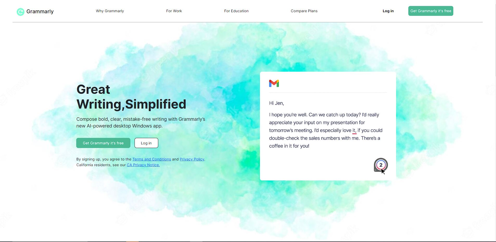
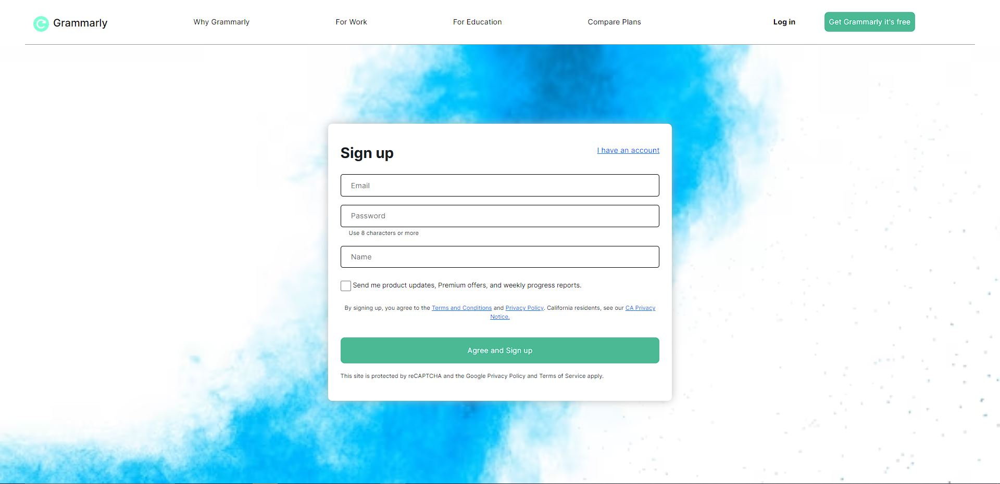
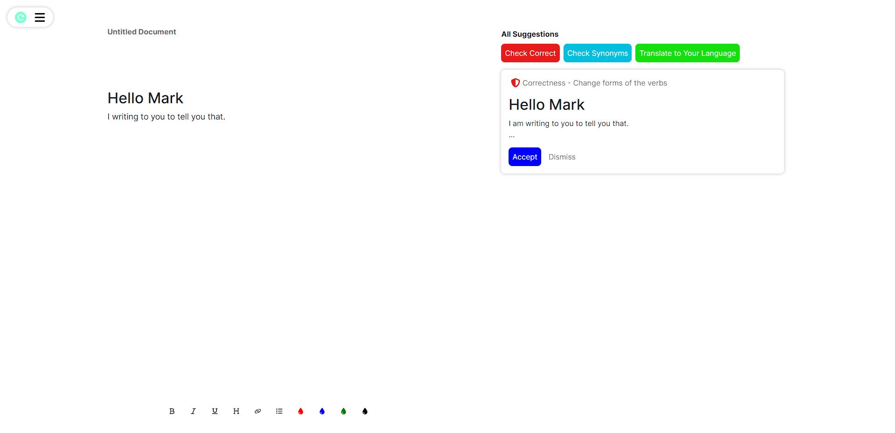
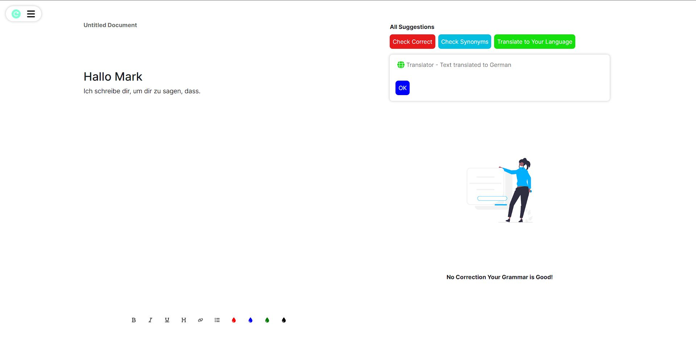
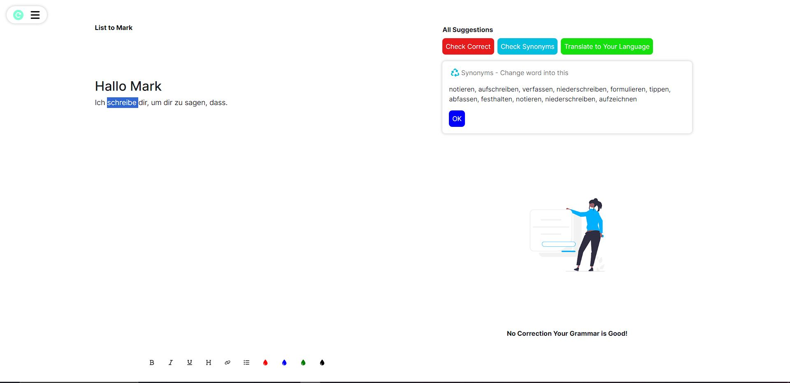
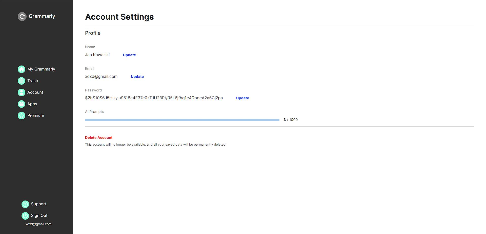
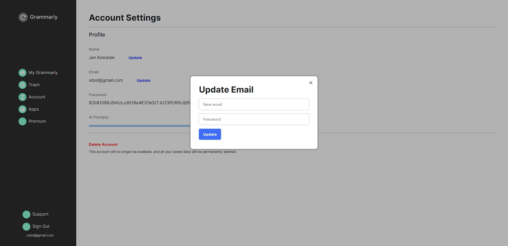

# Grammaly Clone App

Welcome to the Grammaly Clone App repository! This app is designed to provide users with features similar to the popular grammar checking tool. Users can create accounts, create and edit documents, check the grammar of their text, find synonyms for words, and even translate text to other languages. The app is built using Next.js, CSS Modules, React with TypeScript, and utilizes the OpenAI API for grammar checking.

## Features

- **Account Creation:** Users can sign up and create their own accounts to start using the app's features.

- **Document Editing:** Create and edit documents within the app's interface. The editing experience is user-friendly and intuitive.

- **Grammar Checking:** The app integrates with the OpenAI API to provide grammar checking services, helping users improve the quality of their written content.

- **Synonym Finder:** Users can explore synonyms for words, enhancing the vocabulary and language variety in their documents.

- **Text Translation:** The app supports translation of text into various languages, making it useful for multilingual users.

## Desktop View

### Home page

  

### Sign up page

  

### App page grammar check

  

### App page translate text

  

### App page synonyms check

  

### Account setting page

  

### Account setting page update email

  

## Tech Stack

- Frontend:
  - Next.js
  - React (TypeScript)
  - CSS Modules for styling

- Backend/API:
  - Next.js API routes

- External APIs:
  - OpenAI API for grammar checking

## Future Plans

- **Mobile App:** While the current version of the app doesn't have a dedicated mobile layout, the future plan includes developing a React Native mobile app to provide a seamless experience for users on their phones.

## Contributing

Contributions to this project are welcome! Feel free to submit pull requests or open issues for any bugs, features, or improvements you'd like to see.

## License

This project is licensed under the [MIT License](LICENSE).

---

I hope you enjoy using the Grammaly Clone App and find it helpful for your writing needs. If you have any questions or feedback, please don't hesitate to reach out.
